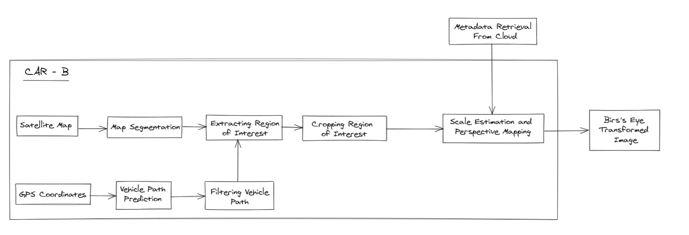

# CenterTrack, Perspective Mapping and Satellite Images

## Introduction

The goal of this project is to generate roadway images with just artifacts and not sending the entire image. **Visual-Inertial-Semantic Scene Representation** is the primary approach explored in the project. In this technique, a 3D object detector is used to estimate the size and distance of the artifact of our interest. This information is then sent to the cloud which can be used either for big data analytics such as traffic estimation or for storage. The stored information is usually retreived by another car B to recreate a scene, thereby reducing the cost associated with running the entire pipeline again. Therefore, the overall architecture is divided into two steps both of which are explained in details below.

#### Step 1:- Localization and Metadata Generation

The overall pipeline for the first step is shown in the figure below:-

<p align="center">  </p> 

An image from camera is prerocessed and fed as input to a 3D object detection algorithm. For this project, we have used [CenterTrack](https://github.com/xingyizhou/CenterTrack) with a few modifications as to output the required metadata for our use case. The backbone of the network is [DCNv2](https://github.com/CharlesShang/DCNv2) and it has been tested to give better results than other standard backbones such as ResNet or VGG. The network outputs all the essential information, such as object category, 3D bounding box and box orientation, that is required to exactly localize the object in a space and links it with a particular GPS coordinate so that it can be traced back to this particular location by another car B or the cloud. The entire GPS → metadata mapping is stored as a dictionary and transferred to the cloud, which recreates and analyzes the data in real-time setting.

#### Step 2:- Recreating the Scene

<p align="center">  </p>

The basic assumption for this step is that a GPS sensor and a local segmented satellite map is available on car B. First, a basic path prediction algorithm is implemented to estimate the direction in which the car is moving, which defines the orientation of the car. The information obtained from this step is used to extract the region of interest on a full scale satellite map that helps to concentrate at a particular location at which the car is present, rather than the entire city. Parallely, GPS-coordinate information is sent to the cloud for requesting the metadata. The cloud provides the metadata, which is then expanded and overlayed with proper scaling on the extracted satellite map to recreate the entire scene of the location.

## Installation

Please refer to [INSTALL.ipynb](INSTALL.ipynb) notebook for installation using JUPYTER NOTEBOOK. Alternatively, you can following the steps below:-

The code was tested on Ubuntu 18.04.5 LTS, with Python 3.7.10, CUDA 11.0, and PyTorch v1.7.1.

#### Step 1. Installing required packages

First step is to download all the required python packages that are necessary to run the code. Since the dependancies are defined in requirements.txt, this can be easily done by running the cell below. Please ensure that you have pip installed earlier in the environment. If not then please uncomment the first line that should install the pip.

```
# Uncomment this below line only if pip is not installed in your environment.
# apt install python3-pip

pip install -r requirements.txt
```

#### Step 2. Building DCNv2

DCNv2 is the backbone used in the CenterTrack. Please note that a CUDA, g++, gcc are required for building the code for DCNv2. To check if these are install, run the command below. 

```
nvcc --version         # For checking CUDA
gcc --version          # For checking C compiler
g++ --version          # For checking C++ compiler
```

Once the requirements are satisfied, run the following command which should build DCNv2 and NMS for non-maxima supression. 

```
cd src/lib/model/networks/DCNv2
python setup.py build develop
cd ../../../../..
```

#### Step 3. Installing the Model Weights

Model weights are currently stored in s3 bucket and are provided with this project code. Please run the following line of code to download the weights.

```
cd ../../
make EXPT_NAME=centertrack sync_data_from_s3
cd source/CenterTrack/
```


## Inference

### Part 1:- Localization and Metadata Generation (Car A)

Please refer to [INFERENCE_CAR_A.ipynb](INFERENCE_CAR_A.ipynb) notebook for running the object detection inference code on a video/image using JUPYTER NOTEBOOK. This notebook performs the Step 1 (Car A) explained in the introduction. Alternatively, you can following the steps below:-

The code below executes the first step, i.e. it takes an image from camera, and maps it to GPS → metadata mapping that is finally transferred to the cloud or car B. For a detailes explaination of what it does, please refer to the introduction section.

**Important points to Note:-**

- For the inference results to run properly, following data is necessary -
    - Video on which inference needs to be run.
    - GPS-coordinate corresponding to each video frame in a CSV file.

- Please keep the CSV file containing the GPS coordinates in the *src/satmap/* directory. Also note that the name of the CSV file shoud be *1_x_all.csv* where x denotes the sequence number (x = 1, 2, 3...) as per the dataset provided dataset TCJP/TMC. 
    
- The output video is stored in *results/* directory which is automatically created after inference runs successfully. Similarly, the metadata is stored in *metadata/* directory. This can then be transferred to the cloud or car B.

- Please specify the location of model weights and the inference video in the next cell. For the purpose of demo, we will be retrieving this data from s3 buckets.

```
VIDEO_PATH=../../data/centertrack/Negley_Black.mp4           # Path to the demo video
MODEL_PATH=../../model/centertrack/nuScenes_3Dtracking.pth   # Path to the model weights
```

- The video is assumed to be from denso camera, which was provided as dataset by TCJP/TMC. If some other camera is used, then please change the focal length and video size accordingly for proper results.

After following the above steps, run the command below to for inference results:-

```
python src/inference_car_a.py tracking,ddd \
    --save_framerate 10 \                             # FPS of output video
    --track_thresh 0.3  \                             # Threshold for detection
    --test_focal_length 1323 \                        # Focal length of the camera
    --save_video \                                    # Option to save the video or not
    --resize_video --video_h 1282 --video_w 2090 \    # Size of the input video
    --skip_first 720 \                                # How many frames to skip at the beginning
    --demo ${VIDEO_PATH}\                             # path to the demo video
    --load_model ${MODEL_PATH}                        # path to the model weights
```


### Part 2:- Recreating the Scene (Car B)

For running the scene recreation script, please refer to [INFERENCE_CAR_B.ipynb](INFERENCE_CAR_B.ipynb) using JUPYTER NOTEBOOK. This notebook performs the Step 2 (Car B) explained in the introduction. Alternatively, you can following the steps below:-

The code below executes the second step, i.e. it recreates the scene from metadata generated by car A. For a detailes explaination of what it does, please refer to the introduction section.

**Important points to Note:-**

- For the inference results to run properly, following data is necessary -
    - Satellite map of the city/portion of the city
    - Metadata stored in *metadata/* directory generated from inference in car A.
    - GPS-coordinate corresponding to each video frame in a CSV file.

- Please keep the CSV file containing the GPS coordinates in the *src/satmap/* directory. Also note that the name of the CSV file shoud be *1_x_all.csv* where x denotes the sequence number (x = 1, 2, 3...) as per the dataset provided dataset TCJP/TMC. Similarly, satellite map from Google Maps API must be kept under same directory. A sample of both the data is provided with this project code. 

- The output video is stored in *results/* directory which is automatically created after inference runs successfully.

After following the above steps, run the command below to for inference results:-

```
python src/inference_car_b.py
```

## Training CenterTrack

CenterTrack is the primary 3D object detection algorithm that we have used in this project. The weights provided by us are pre-trained on NuScenes dataset on which we have done transfer learning using CARLA simulator for 10 more epochs. It can be further trained and fine-tuned as and when required. We refer you to original source of [CenterTrack](https://github.com/xingyizhou/CenterTrack) for training steps. Once the model is trained, the final weights can be used with this project for transferring metadata and recreating the scene.    
